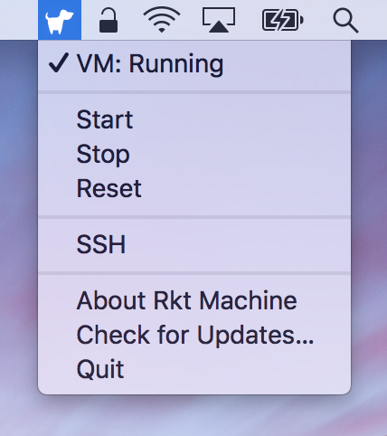

# 

RktMachine is a macOS menu bar app providing a CoreOS VM using HyperKit and the
macOS Hypervisor. It supports developer workflows using the [rkt] container
system.

[rkt]: https://coreos.com/rkt

It can be used to control system dependencies for a project, to provide a
container based environment with necessary dependencies for building and
running software under development, or to try out new tools and services
quickly.

RktMachine is a combination of [coreos-osx] and [corectl.app], two macOS menu
bar apps from [TheNewNormal] using their [corectl] CoreOS VM management tool.
The apps have been integrated into one and a number of choices made to reduce
configurability. See [TheNewNormal] GitHub project for more advanced macOS
tools supporting Kubernetes. 

[TheNewNormal]: https://github.com/TheNewNormal
[coreos-osx]: https://github.com/TheNewNormal/coreos-osx
[corectl.app]: https://github.com/TheNewNormal/corectl.app
[corectl]: https://github.com/TheNewNormal/corectl

Detailed documentation is provided in the [docs] directories and at
[woofwoofinc.github.io/rktmachine].

[docs]: docs
[woofwoofinc.github.io/rktmachine]: https://woofwoofinc.github.io/rktmachine

Installing
----------
To install RktMachine, download a dmg from [releases], open it and copy the
RktMachine.app binary to your `/Applications` folder.

[releases]: https://github.com/woofwoofinc/rktmachine/releases

Usage
-----
The app will prompt for your user password in order to start the `corectl`
service as `root`.

On start, the app will boot the existing CoreOS VM if available or attempt to
create and boot a new CoreOS VM. The VM can be managed from the menu bar icon,
a dog silhouette.

SSH to the CoreOS VM is also available from this menu. The current user home
directory is mounted from the host macOS onto the CoreOS VM at the same
location, e.g. /Users/<name>.

See the full tutorial at [woofwoofinc.github.io/rktmachine/tutorial.html].

[woofwoofinc.github.io/rktmachine/tutorial.html]: https://woofwoofinc.github.io/rktmachine/tutorial.html

Developing
----------
The RktMachine application is built using Xcode. To run a development build,
start by opening the RktMachine project file in Xcode.

Then make sure you are not already running RktMachine and use the
`Product -> Run` menu option or the play button in the top left to build and
run the source code.

There is lots more documentation about building RktMachine in the [docs]
directories and at [woofwoofinc.github.io/rktmachine].

If you want to help extend and improve RktMachine, then your contributions
would be greatly appreciated. Check out our [GitHub issues] for ideas or a
place to ask questions. Welcome to the team!

[GitHub issues]: https://github.com/woofwoofinc/rktmachine/issues

License
-------
This work is dual-licensed under the Apache License, Version 2.0 and under the
MIT Licence.

You may license this work under the Apache License, Version 2.0.

    Copyright 2017 Woof Woof, Inc. contributors, Rimas Mocevicius

    Licensed under the Apache License, Version 2.0 (the "License");
    you may not use this file except in compliance with the License.
    You may obtain a copy of the License at

        http://www.apache.org/licenses/LICENSE-2.0

    Unless required by applicable law or agreed to in writing, software
    distributed under the License is distributed on an "AS IS" BASIS,
    WITHOUT WARRANTIES OR CONDITIONS OF ANY KIND, either express or implied.
    See the License for the specific language governing permissions and
    limitations under the License.

Alternatively, you may license this work under the MIT Licence at your option.

    Copyright (c) 2017 Woof Woof, Inc. contributors, Rimas Mocevicius

    Permission is hereby granted, free of charge, to any person obtaining a copy
    of this software and associated documentation files (the "Software"), to deal
    in the Software without restriction, including without limitation the rights
    to use, copy, modify, merge, publish, distribute, sublicense, and/or sell
    copies of the Software, and to permit persons to whom the Software is
    furnished to do so, subject to the following conditions:

    The above copyright notice and this permission notice shall be included in all
    copies or substantial portions of the Software.

    THE SOFTWARE IS PROVIDED "AS IS", WITHOUT WARRANTY OF ANY KIND, EXPRESS OR
    IMPLIED, INCLUDING BUT NOT LIMITED TO THE WARRANTIES OF MERCHANTABILITY,
    FITNESS FOR A PARTICULAR PURPOSE AND NONINFRINGEMENT. IN NO EVENT SHALL THE
    AUTHORS OR COPYRIGHT HOLDERS BE LIABLE FOR ANY CLAIM, DAMAGES OR OTHER
    LIABILITY, WHETHER IN AN ACTION OF CONTRACT, TORT OR OTHERWISE, ARISING FROM,
    OUT OF OR IN CONNECTION WITH THE SOFTWARE OR THE USE OR OTHER DEALINGS IN THE
    SOFTWARE.

The license explainers at [Choose a License] may be helpful. They have
descriptions for both the [Apache 2.0 Licence] and [MIT Licence] conditions.

[Choose a License]: http://choosealicense.com
[Apache 2.0 Licence]: http://choosealicense.com/licenses/apache-2.0/
[MIT Licence]: http://choosealicense.com/licenses/mit/

Contributing
------------
Please note that this project is released with a [Contributor Code of Conduct].
By participating in this project you agree to abide by its terms. Instances of
abusive, harassing, or otherwise unacceptable behavior may be reported by
contacting the project team at woofwoofinc@gmail.com.

[Contributor Code of Conduct]: docs/conduct.rst

Unless you explicitly state otherwise, any contribution intentionally submitted
for inclusion in the work by you, as defined in the Apache-2.0 license, shall be
dual licensed as above, without any additional terms or conditions.
