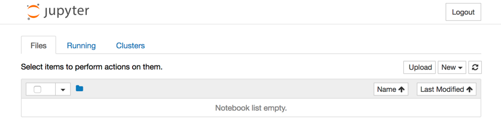

.. _tutorial:

Tutorial
========
.. NOTE::
   RktMachine needs macOS Yosemite or later to run. This is because Yosemite
   was the first version of macOS with the `native Hypervisor Framework`_ for
   running VMs.

.. _native Hypervisor Framework: https://developer.apple.com/reference/hypervisor

Installing RktMachine
---------------------
Begin by downloading the latest version of RktMachine from the
`RktMachine releases`_ page on GitHub.

.. _RktMachine releases: https://github.com/woofwoofinc/rktmachine/releases

RktMachine sometimes needs to use superuser permissions during operation and
contains other privilege escalation points. For this reason, it is important
to verify that the RktMachine download corresponds with the SHA256 checksum
provided on the RktMachine releases page.

::

    shasum -a 256 /path/to/downloaded/RktMachine.dmg

When you are happy that you have an authentic ``RktMachine.dmg``, go ahead
and open it.

It is also insecure to run applications directly from a disk archive so copy
RktMachine to your ``Applications`` folder using the provided shortcut.

Starting the RktMachine CoreOS VM
---------------------------------
Open RktMachine from your ``Applications`` folder. On start, RktMachine will
notify you that it will ask for your user password. This is needed to start the
Corectl_ daemon service as the superuser.

.. _Corectl: https://github.com/TheNewNormal/corectl

The password dialogue may look like the following if you have Touch ID
available.

Or like the following for password entry.

Corectl, which stands for CoreOS Control, is the service used by RktMachine to
create and manage a VM on the macOS hypervisor. Corectl installs CoreOS_ Linux
on the VM, a distribution usually deployed on cloud infrastructure. This
distribution is also well suited for running rkt containers and managing network
bridging for the RktMachine environment.

.. _CoreOS: https://coreos.com

After the application has started, a new menu bar icon will appear in the shape
of a dog silhouette. This is the RktMachine control menu where VMs may be
started and stopped. There are also options for connecting to a running VM
using SSH, for resetting the current VM to a completely clean state, and for
checking for updates to the RktMachine app.

RktMachine will automatically start a VM when it is opened. This will cause a
terminal window to open showing progress.

If this is the first time RktMachine is run then it will first download the
latest CoreOS image.

::

     ______ __    __   _______            __    __
    |   __ |  |--|  |_|   |   .---.-.----|  |--|__.-----.-----.
    |      |    <|   _|       |  _  |  __|     |  |     |  -__|
    |___|__|__|__|____|__|_|__|___._|____|__|__|__|__|__|_____|

                                                Woof Woof, Inc.

    > booting rktmachine (1/1)
    ---> downloading and verifying stable/1298.7.0
    2.12 MB / 33.47 MB [==>------------------------------------] 6.35 % 47s

First the Linux kernel ``coreos_production_pxe.vmlinuz`` is downloaded and
verified to be authentic. Then the main CoreOS stable image is downloaded.

::

    ---> SHA512 hash for coreos_production_pxe.vmlinuz OK
    54.09 MB / 235.47 MB [=========>---------------------------] 22.97 % 4m27s

Once this is complete the image is verified and the version is logged.

::

    ---> SHA512 hash for coreos_production_pxe_image.cpio.gz OK
    ---> stable/1298.7.0 ready

It is only necessary to download the CoreOS images once. RktMachine will
usually start from this point and boot the last previously loaded VM
instead.

RktMachine boots the CoreOS VM.

::

    ---> 'rktmachine' started successfuly with address 192.168.64.19 and PID 17660
    ---> 'rktmachine' boot logs can be found at '/Users/docrualaoich/.coreos/running/C16CF576-FB07-4DC9-8BF6-C022445B31A8/log'
    ---> 'rktmachine' console can be found at '/Users/docrualaoich/.coreos/running/C16CF576-FB07-4DC9-8BF6-C022445B31A8/tty'

Finally our VM is ready to be used.

Building a rkt Container
------------------------
Select the SSH option from the RktMachine menu bar app. This will open a new
terminal window and connect to the RktMachine CoreOS VM.

::

     ______ __    __   _______            __    __
    |   __ |  |--|  |_|   |   .---.-.----|  |--|__.-----.-----.
    |      |    <|   _|       |  _  |  __|     |  |     |  -__|
    |___|__|__|__|____|__|_|__|___._|____|__|__|__|__|__|_____|

                                                Woof Woof, Inc.

    Last login: Sat Apr 22 22:59:34 UTC 2017 on ttyS0
    Container Linux by CoreOS stable (1298.7.0)
    Update Strategy: No Reboots
    core@rktmachine ~ $

Your user home directory is mounted from your macOS to the CoreOS VM using NFS
and available with the same ``/Users/<username>`` directory path as on your
macOS. This is convenient for exchanging files between the CoreOS VM and the
host macOS.

(The NFS may take a couple of moments to appear after startup so don't panic if
it is not there immediately.)

.. TIP::
   For convenience add symbolic links in the home directory on the CoreOS VM
   pointing useful directories on the ``/Users`` mount.

For this tutorial, we will use the example of creating a container to run a
Jupyter_ server. This is the notebooking system which was previously called
iPython Notebook before being extended to other backends.

.. _Jupyter: http://jupyter.org

The buildah_ command line tool is one of the tools which can used to build
containers for rkt. It comes preinstalled by RktMachine on the CoreOS VM.

.. _buildah: https://github.com/projectatomic/buildah

Start the container from scratch.

(Note that superuser privileges are needed to run buildah commands.)

::

    sudo buildah from scratch --name jupyter

We can verify that buildah has added the container by running:

::

    $ sudo buildah containers
    CONTAINER ID  BUILDER  IMAGE ID     IMAGE NAME                       CONTAINER NAME
    11596f165083     *                  scratch                          jupyter

Note that there is no image yet, we have just created an ad hoc container so
far. This means that the output from ``buildah images`` won't include this new
container.

This is an empty container and does not include any content yet. To add a useful
filesystem, first download a base image provided by Ubuntu.

::

    wget http://cdimage.ubuntu.com/ubuntu-base/releases/17.10/release/ubuntu-base-17.10-base-amd64.tar.gz

To get this onto the container, we mount the container using ``buildah mount``:

::

    $ sudo buildah mount jupyter
    /var/lib/containers/storage/devicemapper/mnt/088dc2059ad551206611cc519f1ea11428862f7f4f5842b9049edc785d91a646/rootfs

The output is the mount location on the host. Verify that the container is empty
by checking the mount has no content:

::

    $ sudo ls /var/lib/containers/storage/devicemapper/mnt/088dc2059ad551206611cc519f1ea11428862f7f4f5842b9049edc785d91a646/rootfs

To add the content, untar the Ubuntu base image to this location. The untar has
to be done as root for permission to write to the mount location.

::

    $ sudo tar xzf ubuntu-base-17.10-base-amd64.tar.gz \
      -C /var/lib/containers/storage/devicemapper/mnt/088dc2059ad551206611cc519f1ea11428862f7f4f5842b9049edc785d91a646/rootfs

And verify that the container can now usefully run bash:

::

    sudo buildah run jupyter bash

Then umount the container filesystem since we will execute commands on the
container instead from now.

::

    sudo buildah umount jupyter

This creates the basic layout of the container. The buildah command has a number
of subcommands which can be used to add and perform operations on the base
image. A full list of which can be seen by running ``buildah --help``.

We will be mainly interested in the ``buildah run`` subcommand. This loads the
container in its current state and performs a command from within the
container. We will use this to run apt and other installation instructions on
the container itself.

Start by updating the Ubuntu base installation and adding some required
utilities, wget and bzip2. These are needed for later steps in the installation.

::

    sudo buildah run jupyter -- apt-get update -qq
    sudo buildah run jupyter -- apt-get upgrade -qq
    sudo buildah run jupyter -- apt-get install -qq wget bzip2

Next, we perform the Jupyter installation steps. Since we are interested
mainly in the parts of this to do with creating containers, we'll skip through
the actual Jupyter installation quickly.

(For anyone interested, Jupyter is installed by first installing the
miniconda_ minimal distribution of Anaconda_, a Python data science platform
and then using the package manager for that to install the rest of the parts.)

.. _miniconda: https://conda.io/miniconda.html
.. _Anaconda: https://www.continuum.io

::

    sudo buildah run jupyter -- wget https://repo.continuum.io/miniconda/Miniconda3-latest-Linux-x86_64.sh
    sudo buildah run jupyter -- bash Miniconda3-latest-Linux-x86_64.sh -b -p /usr -f
    sudo buildah run jupyter -- rm -fr Miniconda3-latest-Linux-x86_64.sh
    sudo buildah run jupyter -- conda install -y numpy matplotlib pandas scikit-learn jupyter
    sudo buildah run jupyter -- conda install -y pytorch torchvision -c soumith
    sudo buildah run jupyter -- mkdir -p /home/jupyter

To be able to use the Jupyter service from your macOS, you need to make the
port on which it will run available. This is done by specifying the ports
which should be accessible on the container.

We will run Jupyter on port 80, so make this available.

(CoreOS takes care of ensuring there is a bridge between the CoreOS VM external
network which your macOS can reach and containers running inside the VM. This
means that this port 80 is effectively port 80 on the CoreOS VM too.)

::

    sudo buildah config jupyter --port 80

Next, set a command for the container to run when it starts. We use a very
permissive/insecure Jupyter run line.

::

    sudo buildah config jupyter \
      --entrypoint "jupyter notebook --no-browser --allow-root --ip='*' --port=80 --notebook-dir=/home/jupyter --NotebookApp.token=''"

And finally, clean as much off the container image as we can to save space.

::

    sudo buildah run jupyter -- apt-get -qq autoremove
    sudo buildah run jupyter -- apt-get -qq clean

Once we are ready, we create the container image file by committing the image
to the container storage first. The ``-rm`` option deletes the build container
once the image has been created.

::

    sudo buildah commit -rm jupyter jupyter

The committed image should be present in the image listing now.

::

    $ sudo buildah images
    IMAGE ID      IMAGE NAME                        CREATED AT        SIZE
    b119130b4473  docker.io/library/jupyter:latest  Jan 2, 2018 22:31 3.79 GB

Export the container layout into OCI format in the local directory by using
the push subcommand.

::

    $ sudo buildah push jupyter oci:jupyter:latest

OCI format is a tar archive of this. We also need to create the .oci tar file
without the directory name prefix.

::

    tar cf jupyter.oci -C jupyter .

We finish the container build by removing the image from buildah and deleting
the intermediate files.

::

    sudo buildah rmi jupyter
    sudo rm -fr jupyter

Installing and Running rkt Containers
-------------------------------------
Continuing the Jupyter server example, we have to convert the OCI image into an
ACI before it can be used in rkt on the CoreOS VM. The docker2aci command is
available for this task.

::

    docker2aci jupyter.oci
    mv jupyter-latest.aci jupyter.aci

Then import the container into rkt by running:

::

    rkt --insecure-options=image fetch ./jupyter.aci

Since this is a large image, it will take a short while for the container to be
imported. Once done, we can see it by listing the containers available in rkt
on the CoreOS VM.

::

    $ rkt image list
    ID                      NAME                                    SIZE    IMPORT TIME     LAST USED
    sha512-e1e9e1991658     jupyter                                 3.3GiB  4 minutes ago   4 minutes ago
    sha512-fdd18d9c2103     coreos.com/rkt/stage1-coreos:1.21.0     184MiB  53 minutes ago  53 minutes ago

Start an instance of the container using ``rkt run``. Note that superuser
privileges are needed.

::

    sudo rkt run --port=80:80 jupyter

This starts the container we built in the previous section and runs the Jupyter
start command we specified. This makes a Jupyter server available on port 80 of
the CoreOS VM.

The RktMachine CoreOS VM comes installed with `Avahi mDNS`_. This is configured
to broadcast a ``rktmachine.local`` DNS entry for the CoreOS VM. So you will be
able to connect to the Jupyter server by opening `rktmachine.local`_ in a
browser window.

.. _Avahi mDNS: http://www.avahi.org
.. _rktmachine.local: http://rktmachine.local

You should see a blank Jupyter notebook system.

See the section on :ref:`workingwithrkt` for more details on using rkt.

Running rkt Containers Interactively
------------------------------------
It is often useful to run a Bash shell on a container instead of the default
command. This is particularly the case when we also mount directories from the
host to the rkt container.

For instance, suppose we wanted to run a Jupyter server which automatically
included a set of notebooks from the host macOS. The Jupyter server can be
configured to run with a base directory of our choice. We just need to make it
so that this location is available to the container.

For this, we use:

- The ``--interactive`` option to the ``rkt run`` to specify that we want to be
  able to type commands to the container.
- The ``--exec /bin/bash`` option to override the default command line in the
  container and to run Bash instead. This means we have now have an interactive
  shell on the container instead of a default Jupyter server.
- ``--volume rktmachine,kind=host,source=/Users/<username>/path/to/notebooks``
  defines a storage named ``rktmachine`` which we can mount to the container.
  It will be linked to the directory given in the ``source`` attribute.
- Finally, we use ``--mount volume=rktmachine,target=/rktmachine`` to add this
  storage inside the container under the path ``/rktmachine``.

::

    sudo rkt run \
        --interactive \
        --port=80:80 \
        --volume rktmachine,kind=host,source=/Users/docrualaoich/notebooks/ \
        jupyter \
        --mount volume=rktmachine,target=/rktmachine \
        --exec /bin/bash

Alternatively, it is often easier to just change to the desired directory first
and use ``$(pwd)`` as the volume source.

::

    sudo rkt run \
        --interactive \
        --port=80:80 \
        --volume rktmachine,kind=host,source=$(pwd) \
        jupyter \
        --mount volume=rktmachine,target=/rktmachine \
        --exec /bin/bash

Once on the container, change to ``/rktmachine`` to see the notebooks and start
Jupyter from that directory.

::

    cd /rktmachine
    jupyter notebook --no-browser --allow-root --ip='*' --port=80 \
        --notebook-dir=/rktmachine --NotebookApp.token=''

If you open `rktmachine.local`_ now, you will see a Jupyter server with the
notebooks already available.
